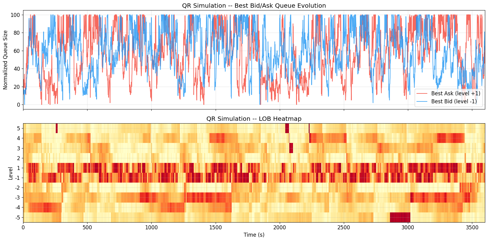

# Deep Learning Meets Queue-Reactive: A Framework for Realistic LOB Simulation

## 1. Project Overview

This repository implements a progressive framework for simulating Limit Order Book (LOB) dynamics, moving from the classical **Queue-Reactive (QR)** model to the state-of-the-art **Multidimensional Deep Queue-Reactive (MDQR)** model. 

The project is based on the research paper by **Hamza Bodor and Laurent Carlier (2025)**: *["Deep Learning Meets Queue-Reactive: A Framework for Realistic Limit Order Book Simulation"](https://arxiv.org/abs/2501.08822)*.

Our implementation uses **LOBSTER** NASDAQ data (AAPL, INTC, GOOG, MSFT) as a proxy for the Bund futures analyzed in the original paper. We demonstrate how deep learning can generalize the QR framework to capture complex market microstructure phenomena while maintaining the interpretability of point-process models.

### Key Contributions
- **Neural Intensity Modeling**: Replacing lookup tables with MLPs to handle high-dimensional state spaces.
- **Cross-Level Dependencies**: Jointly modeling multiple price levels to capture queue correlations.
- **Order Size Modeling**: A categorical neural network to predict realistic order sizes.
- **Stylized Facts Validation**: Verification of market impact, return distributions, and price formation.

---

## 2. The Progressive Framework

We follow a three-step modeling approach, implemented across three main notebooks:

### Step 1: Queue-Reactive (QR) Model (Baseline)
The foundation of our simulator is the **QR model** (Huang et al., 2015). It treats each queue size $q$ as a state and models event arrivals (Limit, Cancel, Market) as independent Poisson processes with intensities $\lambda^\eta(q)$.
- **Notebook**: `01_data_and_qr_model.ipynb`
- **Focus**: Data reconstruction, MLE estimation, Gillespie simulation.

*Example of fitted intensity functions for AAPL.*

### Step 2: Deep Queue-Reactive (DQR) Model
The **DQR model** extends the QR framework by parameterizing intensities with neural networks $\lambda^\eta_\theta(x_k)$. This allows us to enrich the state vector $x_k$ with features like:
- **Intraday Seasonality**: Hour of the day ($h_k$).
- **Excitation Effects**: The type of the previous event ($\eta_{k-1}$).
- **Notebook**: `02_dqr_model.ipynb`
- **Focus**: Neural network calibration, feature importance, seasonality analysis.

### Step 3: Multidimensional Deep Queue-Reactive (MDQR) Model
The full **MDQR model** represents the LOB as a unified multidimensional system. It relaxes the independence assumption between queues and adds an explicit model for order sizes.
- **Notebook**: `03_mdqr_model.ipynb`
- **Focus**: Joint queue modeling, Order Size classification, Stylized Facts verification.

---

## 3. Detailed Notebook Walkthrough

### [01_data_and_qr_model.ipynb](01_data_and_qr_model.ipynb)
- **Data Engineering**: Reconstructing LOBSTER message and orderbook files into a clean `State` representation.
- **MLE Calibration**: Analytical derivation and implementation of the Maximum Likelihood Estimator for queue-dependent intensities.
- **Simulator Engine**: Implementation of the **Gillespie algorithm** for event-by-event discrete simulation.
- **Visuals**: Plots of fitted intensity functions across different stocks and price levels.

### [02_dqr_model.ipynb](02_dqr_model.ipynb)
- **Neural Calibration**: Transitioning from lookup tables to PyTorch-based MLPs for intensity prediction.
- **Feature Enrichment**:
    - **Intraday Seasonality**: Capturing the "U-shaped" activity profile of trading days.
    - **Event Excitation**: Modeling how a market order at one level triggers cancellations or limits.
- **Validation**: Quantitative comparison of model log-likelihood and balanced accuracy for next-event prediction.

### [03_mdqr_model.ipynb](03_mdqr_model.ipynb)
- **MDQR Architecture**: A multi-output neural network predicting 30 intensities simultaneously (3 event types $\times$ 10 levels).
- **Order Size Network**: A 200-class categorical classifier trained to reproduce empirical order size distributions.
- **Comprehensive Validation (Stylized Facts)**:
    - **Market Impact**: Reproducing the square-root law of price impact.
    - **Cross-Queue Correlations**: Capturing the negative correlation between best bid/ask queues.
    - **Queue Distributions**: Alignment with historical Gamma-like distributions.
    - **Mid-Price Prediction**: Benchmarking against DeepLOB-style prediction tasks.

---

## 4. Validated Stylized Facts

Our MDQR implementation successfully reproduces several key market microstructure properties:

1.  **Market Impact Profile**: Demonstrates a concave price response to large meta-orders, consistent with the square-root law.
2.  **Queue Correlations**: Unlike independent models, MDQR captures the interaction between different price levels.
3.  **Order Size Patterns**: Correctly identifies "peaks" in order sizes at specific round lots (e.g., 1 lot, 100 lots).
4.  **Excitation**: Correctly predicts event type transitions (e.g., Market order $\to$ Cancel/Limit).

---

## 5. Project Architecture

The core logic is modularized for reusability:

- `mle/`: Statistical calibration tools and LOBSTER IO.
- `models/`: PyTorch definitions for DQR and MDQR architectures.
- `simulator.py`: The discrete-event engine implementing the Gillespie algorithm.
- `analysis.py`: Tools for plotting heatmaps, impact profiles, and return distributions.
- `state.py`: Efficient representation of the Limit Order Book state.
- `intensities.py`: Abstract and concrete implementations of intensity functions.

---

## 6. Setup & Usage

### Prerequisites
- Python 3.10+
- PyTorch (CPU or GPU)
- Standard DS stack: `pandas, numpy, matplotlib, scipy, scikit-learn`

### Quick Start
1.  **Clone the repo**.
2.  **Place data**: Put LOBSTER `.csv` files in the `data/` directory (following the provided sample structure).
3.  **Run Notebooks**: Open the notebooks in order (01, 02, 03) to follow the training and evaluation pipeline.

---

## 7. Academic Context

*   **Institution:** Imperial College London
*   **Module:** Market Microstructure
*   **Supervised by:** Professor Mathieu Rosenbaum

### Authors
*   **Paul Archer** (CID: 06054057)
*   **Thibault Marty** (CID: 06055275)
*   **Rebecca Laïk** (CID: 01776263)

---

## 8. References
*   Bodor, H., & Carlier, L. (2025). *Deep Learning Meets Queue-Reactive: A Framework for Realistic Limit Order Book Simulation*. arXiv:2501.08822.
*   Huang, W., Lehalle, C. A., & Rosenbaum, M. (2015). *Simulating and analyzing order book dynamics: the queue-reactive model*. Journal of Statistical Physics.
*   LOBSTER Data: [https://lobsterdata.com/](https://lobsterdata.com/)
